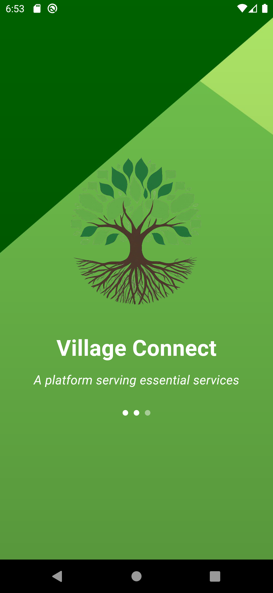

# Village Connect 🌳

The Village Connect app is designed to bridge the gap between villagers and administrative officials. The app features a login system where users are verified by an admin before
activation. The homepage displays announcements about village happenings, posted by
admins. Users can view market prices for crops by selecting locations from dropdown
options. There is an enquiry section where users can ask crop-related questions that
are answered by admins. The suggestions section allows users to report issues they are
facing. Lastly, the emergency section provides contact information for important services
like ambulance, fire, and police stations. Admins have the authority to accept or
reject new users, post announcements, update market prices, answer enquiries, respond
to suggestions, and manage other admins.

## Table of Contents

- [Features](#features)
- [Prerequisites](#prerequisites)
- [Installation](#installation)
- [Contributors](#Contributors)
- [License](#license)

## Features

- Login for Admin and Residents
- Market Updates with crop prices and average prices of the particular village
- Announcements from Admin
- Enquiries and responses
- Suggestions from Residents
- Important Contacts 
- Market price updated by the Admin

### Prerequisites

- Flutter SDK: [Install Flutter](https://flutter.dev/docs/get-started/install)
- Android Studio or Visual Studio Code: [Install Android Studio](https://developer.android.com/studio) / [Install VS Code](https://code.visualstudio.com/)
- Node.js: [Install Node.js](https://nodejs.org/en/download/)
- MySQL: [Install MySQL](https://dev.mysql.com/downloads/mysql/)

### Installation

1. **Fork the repository**

   Fork this repository by clicking on the "Fork" button at the top right of this page.

2. **Clone the repository**

   Clone the forked repository to your local machine:

   ```bash
   git clone https://github.com/EbeyJoeRegi/Village_Connect_App.git
    ```
3. **Navigate to the project directory**

    ```bash
    cd Village_Connect_App
    ```
4. **Setting up the Backend**
    
    1. **Set up the MySQL database**    
     
        open mysql using terminal
        
        Create a database in MySQL
         ```bash
        CREATE DATABASE village_app;
        ```
        Import the database schema and data from the Db folder into your MySQL database
         ```bash
        mysql -u root -p village_app < ../Db/Village_app.sql
        ```

    2. **Navigate to the backend directory**
        
        ```bash
        cd Backend 
        ```

    3. **Install backend dependencies**      

         ```bash
        npm install express mysql2 body-parser cors bcrypt
        ```

    4. **Configure the backend**  

        open server.js,
        make changes to the db connection such as enter your db connection password.

        open terminal in same directory and run the server

         ```bash
        node server.js
        ```
5. **Setting up the Flutter Application**

    1. **Navigate to the Flutter project directory**    
     
        ```bash
        cd '.\Village App\'
        ```

    2. **Install Flutter dependencies**
        
        Install the Flutter packages:
        ```bash
        flutter pub get
        ```

    3. **Run the Flutter application**      

        Connect your device or start an emulator and run the app using:
         ```bash
        flutter run 
        ```
Screenshots of the project is provided in the   `Images`   folder.

Update the API URLs with the system's IP address on each screen in Flutter.

Feel free to reach out to us with any queries.\
**ebeyjoeregi13@gmail.com**

### Contributors

- **[Aju Thomas](https://github.com/Aju34807)** 
- **[Anjalita Joyline Fernandes](https://github.com/Anjalita)** 
- **[Ebey Joe Regi](https://github.com/EbeyJoeRegi)** 

### License
This project is licensed under the MIT License - see the LICENSE file for details.

---
